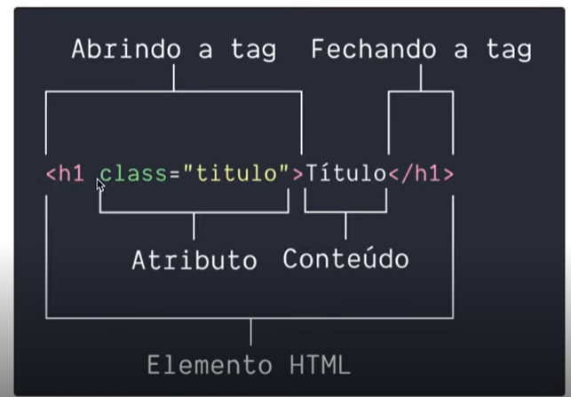
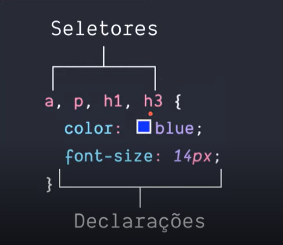
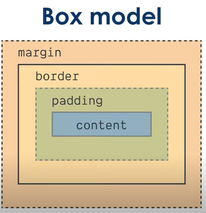
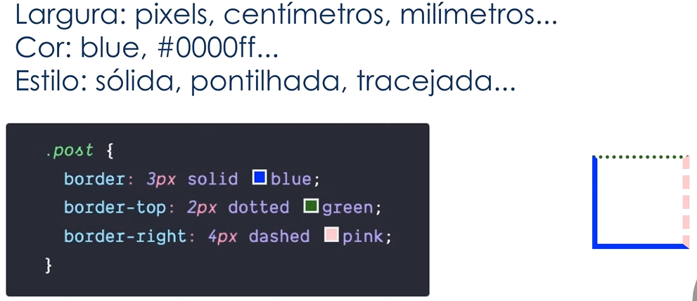

# Introdução ao Curso de HTML

#### Elemento HTML


Ver 1.html

# Entendendo o que é Semantica
```html
<!-- Por muitos anos o elemento padrao era a DIV -->

<!-- Em 2014 foi criado novos elementos
para dar mais significado ao HTML -->

<section>
<!-- Secao Generica de Conteudo. Ex: lista de artigos -->

<header><footer>
<!-- Cabecario/rodape: da pagina/section -->

<section>
<!-- Secao Generica de Conteudo. Ex: lista de artigos -->

<aside>
<!-- Conteudo relacionado ao conteudo principal de uma pagina
Representado uma barra lateral -->

<aside>
<!-- Conteudo relacionado ao conteudo principal de uma pagina -->

<h1><h6>
<!-- Titulos. Regra: só um H1 por página -->

```
Add as tags do html, ver 2.html

# Como usar texto e links em HTML

### Tags para Texto

```html

<h1>Título da Página</h1>

<h2>Título de seção</h2>

<h3>Título de artigos</h3>

<p>Conteúdo de artigo.</p>

```
### Tags para Links

```html

<a>Link</a>

<a href="linkedin.com/in/ruben-com-br">Linkedin</a>

<a href="mailto:br.com.ruben@gmail.com">Email</a>

<a target="_blank">Link</a>
<!-- _blank = nova aba -->

```
Ver 3.html

# Como inserir imagems em seu site

### Tag img
```html


<!-- atributo obrigatorio: caminho da imagem -->


<!-- atributo opcional (mas Recomendado): texto quando não carregado -->

```
Ver 4.html

# Como organizar listar com HTML

### Tag li ul ol
```html

<ul> <!-- lista NÃO ordenada -->
Item 1
Item 2

<ol> <!-- lista ordenada -->
1. Item 1
2. Item 2

<li> <!-- item da lista -->

```
Ver 5.html

# Introducao ao CSS3

### O que são seletores


### ID x classe

```html
<header id="header" class="header"></header>
<header class="header"></header>
```

```css
/* 
  class ⭢ .
  id    ⭢ # 
*/

.header {
  padding: 10px;
}

#header {
  padding: 10px;
}
```
Ver 6.html

### Conceitos Básicos


```python
'''
  Cada elemento html é representado com uma caixa retangular
  chamado de 'Box moddel'

  Com CSS podemos alterar a aparencia desta caixa

  Box Model tem 4 areas

  - margin: espacamento entre elementos
  - border: circunda o padding e o conteudo
  - padding: espacamento entre a borda e o conteudo

'''

Ver 7.html

```

# Estilizando elementos, textos e listas

### Estilizando elementos

```css
/* 10px todos os lados */
.post {
  padding: 10px;
}

/* 
  10px eixo y
   5px eixo x 
*/
.post {
  padding: 10px 5px;
}

.post {
  padding: 15px 10px 5px 0px;
}

.post {
  padding-top: 15px;
  padding-right: 10px;
  padding-bottom: 5px;
  padding-left: 0px;
}

```

```css
/* Background */
.post {
  background-color: green;
  background-color: #008800;
  background: #008800;
}
```

Border


Ver 8.html

### Estilizando textos
```css
.title {
  font-family: Verdana;
  font-family: Verdana, Arial;

  font-size: 30px;
  font-size: 18px;

  font-style: normal;
  font-style: italic;

  font-weight: normal;
  font-weight: bold;

  text-transform: uppercase;
  text-transform: overline;
  text-transform: line-through;
}

```
Ver 9.html

### Estilizando listas
```css
/* list-style-type*/
ul {
  /* simbolo quadrado */
  list-style-type: square;
}

ol {
  /* algarismo romano */
  list-style-type: upper-roman;
}

ul {
  /* emoji joinha */
  list-style-type: "\1F44D";
}

ul {
  /* imagem como mcarcador */
  list-style-image: url("rocket.png");
}

```
Ver 10.html

# Dimensão e Alinhamento
```css
/* ajustar tamanho */
Width
Height

/* limitar tamanho */
Max-width
Max-height

Margin

Alignment
```
Ver 11.html